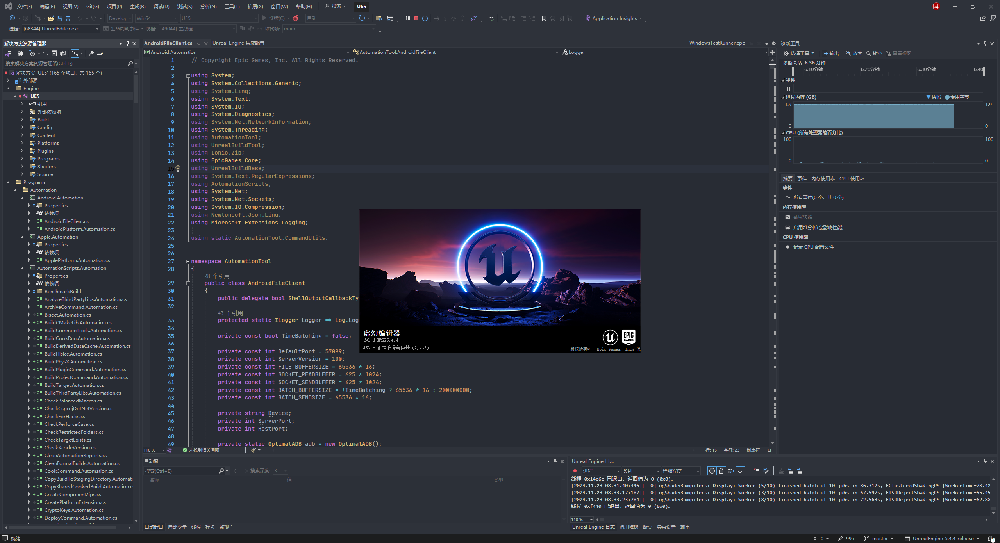
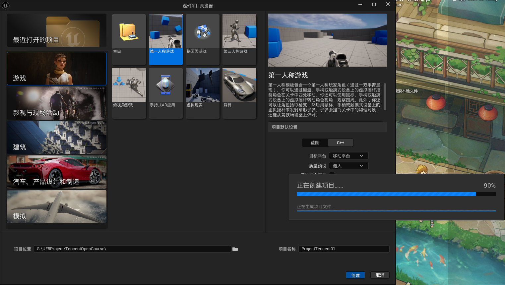
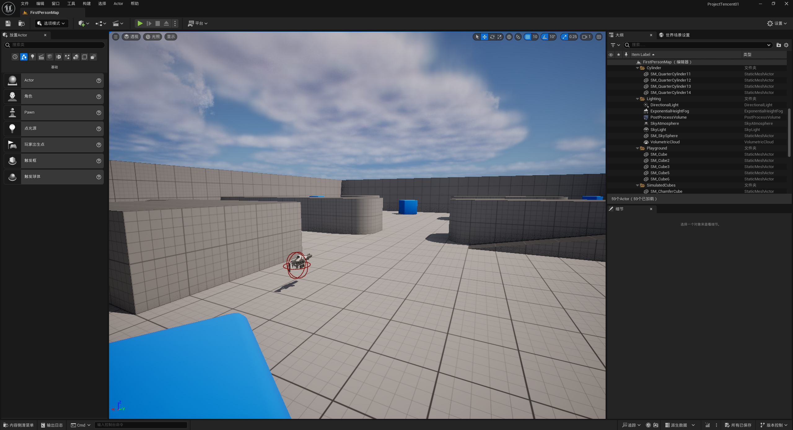
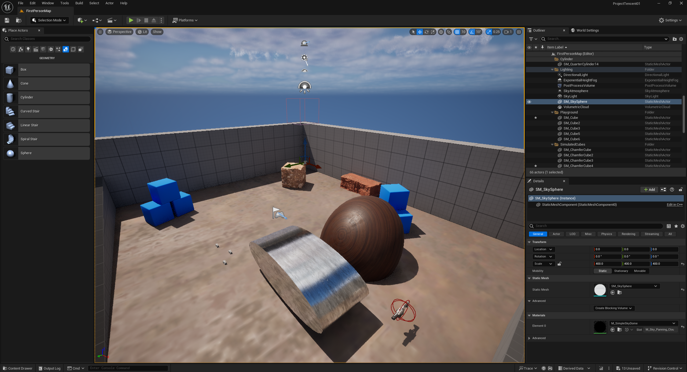
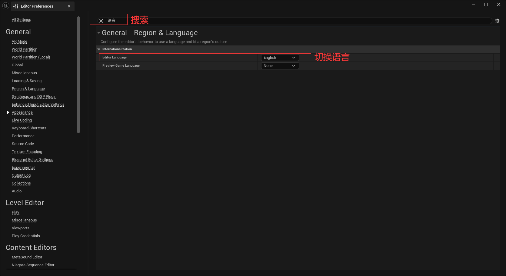
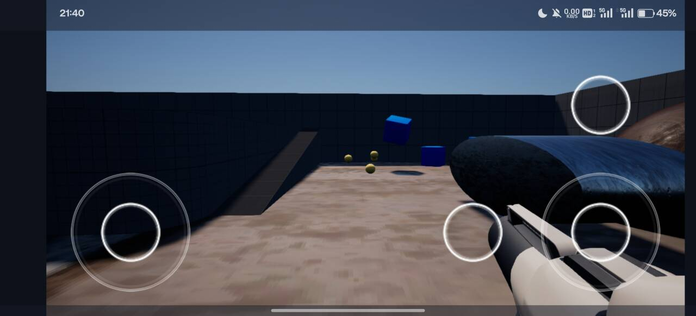

# 第一课：UE入门

**2024年11月16日**

## 课程作业

**（任务1）** 1.源码编译UE5，新建一个C++工程，进行简单场景编辑和工程设置  
**（任务2）** 2.编译并构建安装包，确保能够用来将游戏工程安装到手机正常运行（若无Andorid手机可构建桌面版本）

## 解决方案

### 任务1

#### 1. 源码编译UE5

在我编写这条解决方案的时候，UE的最新版本为*5.5*，但是鉴于新版本的不稳定性，采用次新版本*UnrealEngine-5.4.4-release*

这一步并不复杂，主要问题在以下几点：  
- 不知道UE的官方Github仓库怎么打开
  - 解决方法：  
    首先在Github加入EpicGames组织（参考UE官方教程：[在GitHub上访问虚幻引擎源代码](https://www.unrealengine.com/zh-CN/ue-on-github)）
- 不知道怎么下载源代码
  - 解决方法：  
    请参考UE仓库README信息：[UE的Github仓库](https://github.com/EpicGames/UnrealEngine)
- 不知道怎么编译
  - 解决方法：  
    请参考UE官方教程：[从源代码构建虚幻引擎](https://dev.epicgames.com/documentation/zh-cn/unreal-engine/building-unreal-engine-from-source)
- 引擎编译时间过久（个人编译时长3h+，以下仅供参考）
  - 解决方法：  
    1. 硬件方面：换用性能更高的CPU和内存。内存推荐48G起步（亲测i7-12700H + 64G内存，在编译期间CPU占用一直维持100％，内存占用一直维持在34G左右）
    2. 软件方面：把引擎源代码放进固态硬盘，以及使用官方推荐的Visual Studio 2022版本进行编译。（**如果你的内存较小，不推荐使用Rider编译。** 因为Rider本身的内存占用很高。）
  
编译完成，在VS把项目启动入口设置为“UE5”，然后打开项目，自动启动虚幻编辑器。第一次启动时需要编译着色器，耗时较久：  
  
（为什么要编译着色器？参考b站科普视频：[【OpenGL 篇】为什么游戏总要编译着色器？](https://www.bilibili.com/video/BV1zi421h7tJ/?spm_id_from=333.337.search-card.all.click&vd_source=beddb0c1b3bb7b4cde7a0218114bf1b5)）

#### 2. 新建一个C++工程

在刚刚打开的虚幻项目浏览器里新建一个C++项目。  
考虑到任务2的要求（打手机包），以及后续大作业需要制作FPS游戏，所以使用第一人称游戏模板，目标平台设置为移动平台。  
**注意：项目路径以及项目名称不要设置为中文，否则可能会产生意想不到的问题。**  
新建C++项目：  
  

新建之后的项目不会直接以编辑器的形式打开，这里提供两种打开方式：  
1. 双击项目根目录的 *{项目名称}.uproject* 直接打开。  
2. 打开虚幻项目浏览器，从浏览器找到刚创建的项目打开。  

打开项目：  
   

#### 3. 进行简单场景编辑和工程设置

搞几个简单的几何体，再简简单单从刚刚免费的Quixel Bridge里下载资源随便放一下：  
 

发现编辑器是中文的，可能是根据系统默认语言自动设置的。为了保持编程时的术语一致性，这里改成英文。  
 

---

### 任务2

#### 1. 配置安卓打包环境
参考：[Setting Up Android SDK and NDK](https://dev.epicgames.com/documentation/zh-cn/unreal-engine/set-up-android-sdk-ndk-and-android-studio-using-turnkey-for-unreal-engine)

在这里，UE提供了自动化环境配置脚本**Turnkey**。  
由于我曾经使用Android Studio进行过安卓原生开发，也使用Unity进行过安卓项目打包，所以相关开发环境较为复杂，并不想大动，所以暂不考虑用自动配置脚本。  
我尝试了直接打包，不出意外地出了意外，依次解决了：SDK路径问题，版本问题，NDK版本问题，等等。但是最后遇到了Android Studio版本问题。  

这个问题不容易解决，我最终选择卸载原本的Android Studio并且清空相关环境，然后重新下载UE5.4.4打包规定的版本：2022.2.1  
然后运行自动化环境配置脚本即可。中途可能出现SDK路径问题，请修改相关的环境变量。  

#### 2. 打包
- 问题1：
  > LogCook: Error: Content is missing from cook. Source package referenced an object in target package but the target package was marked NeverCook or is not cookable for the target platform.

  解决方法：  
  参考：[UE官方论坛讨论](https://forums.unrealengine.com/t/logcook-error-content-is-missing-from-cook-source-package-referenced-an-object-in-target-package-but-the-target-package-was-marked-nevercook-or-is-not-cookable-for-the-target-platform/1825570/40)
  根据讨论区提出的解决方案，首先尝试将Quixel Bridge资源都删除，但是没有解决问题。  
  实际解决方法是，在项目目录-> Config -> DefaultEditor.ini 里加上更改报错级别的语句：
  ```
  [CookSettings]
  CookContentMissingSeverity=Warning
  ```
  **这也说明，其实这个错误并不影响游戏运行，这里并不一定是真的有错误。**
- 问题2:
  > UATHelper: Packaging (Android (ETC2)): Downloading https://services.gradle.org/distributions/gradle-7.5-all.zip UATHelper: Packaging (Android (ETC2)): Exception in thread "main" java.net.ConnectException: Connection timed out: connect
  
  解决方法：  
    这是简单的网络环境问题，解决方法参考：[ue5 - android 打包卡在下载gradle Downloading https://services.gradle.org/distributions/gradle-6.1.1-all.zip - 解决](https://www.cnblogs.com/c2g5201314/p/17140634.html)
    下载规定版本的包（gradle-7.5-all）放到指定目录下即可。
  
解决完两个问题以后，就成功打包了。

*其中Cook阶段的时间特别久。*

#### 3. 手机运行

运行成功：  
 

**作业1结束。**


